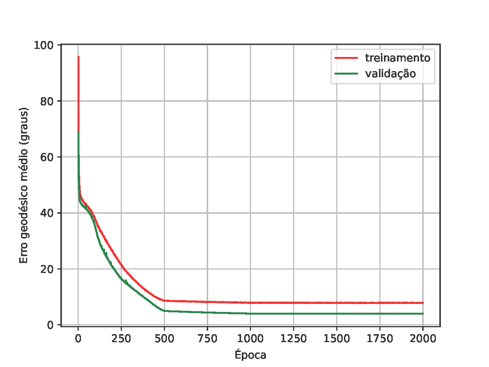

# Topicos-ADCS-2022-1_Attitude-Determination


Este repositório foi desenvolvido no contexto da disciplina de Tópicos Especiais em Engenharia da Universidade de Brasília (UnB) e implementa uma versão adaptada da rede neural desenvolvida por *Dos Santos et al.* para determinação da atitude.

> Dos Santos, G. H., Seman, L. O., Bezerra, E. A., Leithardt, V., Mendes, A. S., & Stefenon, S. F. (2021). ["Static Attitude Determination Using Convolutional Neural Networks"](https://www.mdpi.com/1424-8220/21/19/6419/pdf). Sensors (Basel, Switzerland), 21(19), 6419. https://doi.org/10.3390/s21196419

## Configurações

- Versão do Python: 3.9.5
- Versão do PyTorch: 1.12.1

### Crie um ambiente de desenvolvimento virtual

- No ambiente Windows, no bash do git, execute
```bash
python -m venv pTAD
```

- No ambiente Linux, execute
```bash
python3.9 -m venv pTAD
```

### Ative o ambiente de desenvolvimento virtual

- No ambiente Windows, no bash do git, execute
```bash
source pTAD/Scripts/activate
```

- No ambiente Linux, execute
```bash
source pTAD/bin/activate
```

### Instale as dependências

```bash
pip install -r requirements.txt
```

## Como usar

### Para treinar o modelo

- Com o ambiente de desenvolvimento ativo, execute
```bash
python src/main.py training --model [WEIGHTS] --epochs [INICIO]-[FIM]
```

**[INICIO]**: Primeira época de treino;

**[FIM]**: Última época de treino; e

**[WEIGHTS]**: Pesos do modelo em um dos formatos:
- Caminho dos pesos, como 'model/bswish_model_0005.pth';
- O peso do último treino, ou seja, 'last'; ou
- 'first' para indicar que não tem pesos prévios.

Exemplo do comando:
```bash
python src/main.py training --model first --epochs 1-200
```

### Para avaliar o modelo com o dataset de teste

- Com o ambiente de desenvolvimento ativo, execute
```bash
python src/main.py test --model [WEIGHTS]
```

**[WEIGHTS]**: Pesos do modelo em um dos formatos:
- Caminho dos pesos, como 'model/bswish_model_0005.pth'; ou
- O peso do último treino, ou seja, 'last'.

Exemplo do comando:
```bash
python src/main.py test --model last
```

### Para avaliar o modelo com outros dados

- Com o ambiente de desenvolvimento ativo, execute
```bash
python eval/evaluate.py --input [INPUT] --model [WEIGHTS]
```

**[INPUT]**: Caminho para arquivo ".json" de entrada; e

**[WEIGHTS]**: Pesos do modelo em um dos formatos:
- Caminho dos pesos, como 'model/bswish_model_0005.pth'; ou
- O peso do último treino, ou seja, 'last'.

Exemplo do comando:
```bash
python eval/evaluate.py --input data/arquivo/entrada.json --model last
```

#### Flags opcionais

--output [OUTPUT]:
**[OUTPUT]**: Caminho/nome para o arquivo ".json" de saída;
- Exemplo: --output data/arquivo/saida.json

--wahba_weights [WAHBA]:
**[WAHBA]**: Pesos para o problema de Wahba;
- Exemplo: --wahba_weights 0.225, 0.157, 0.458

--parameterization [PARAMS]:
**[PARAMS]**: Parametrização da matriz de atitude. Pode ser 'axis-angle' ou 'quaternion';
- Exemplo: --parameterization quaternion

#### Formato do arquivo de entrada

O arquivo de entrada deve ser um ".json" com o seguinte formato
```bash
{
    "n": 2,
    "r": {
        "B_eci": "2435.1449234364, 9209.57092801303, 18414.3477578444",
        "Sun_vec_eci": "-0.692699291225791, 0.667793036145862, 0.272433758573305"
    },
    "b": {
        "B_magnetometer": "25538.4613037109, 5461.53869628906, -33307.6934814453",
        "Sun_vec_body_frame": "-0.372567440599065, 0.228045590381382, 0.899549170925675"
    }
}
```

- n: Número de vetores em cada campo;
- r: Vetores no sistema de referência;
- b: Vetores medidos no corpo.

O nome dos vetores é livre, mas devem estar no formato indicado com a separação dos valores por vírgula e espaço.

#### Formato do arquivo de saída

O arquivo de saída será um ".json" com o seguinte formato
```bash
{
    "Parameterization": "axis-angle",
    "Line 1": "0.47368383407592773, -0.2572217881679535, 0.8422948718070984",
    "Line 2": "0.2843320667743683, 0.949848473072052, 0.13016605377197266",
    "Line 3": "-0.8335339426994324, 0.17783388495445251, 0.5230643153190613"
}
```

- Parameterization: Parametrização da matriz de atitude;
- Line 1: Primeira linha da matriz de atitude;
- Line 2: Segunda linha da matriz de atitude;
- Line 3: Terceira linha da matriz de atitude.

## Resultados

### Treino



Resultados ao final do treinamento

|   Etapa   | Erro geodésico |
|:---------:|:--------------:|
|   Treino  |     5,278º     |
| Validação |     1,863º     |

### Teste

|      Erro      | Valor do erro |
|:--------------:|:-------------:|
| Erro geodésico |     2,098º    |
|  Erro de Wahba |     0,002     |